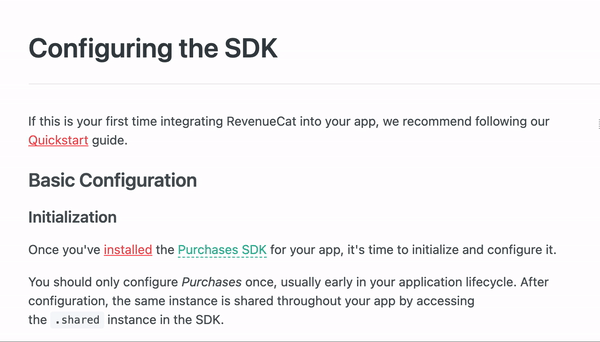

# 
  Creating Structured Content 

When writing technical documentation, there are cases where a table, photo, etc., is the best way to display data. This guide will go over our best practices for creating additional structured content for a page.

## Glossary
Throughout our documentation, we often are referencing products or tools that are unique to RevenueCat.To make sure our reader always understands our references. It’s best to add the glossary term to the reader than review while reading. You can review the ReadMe glossary term guide here for how to add our documentation. 

## Photos
Photos are sometimes needed to display information. We often use photos in our product installation guides to show different dashboards and other relevant information. 

When utilizing photos, make sure it only includes relevant information. If pointing to specific items on the page, make sure to mark up the image to reflect this. We use red cirlce identifiers when marking photos.

Here is an example of a photo marked up for documentation:

Don’t forget to create Alt text that described the photo, allowing access to screen reading technologies.

## Callouts
Some content is so crucial that we need to separate it from the rest of the document. We use flavored callouts to display this. 

### Success
The success callout is best for letting the reader know a task is complete,  a small reminder before continuing, or a helpful tip. 

> 👍  
> 
> This section assumes you've followed our Quickstart section of our Getting Started guide to install and configure our SDK.

### Info 
Info callout is for giving additional relevant information. These callouts shouldn't contain information that must be completed before moving foreward.These should contain links out to external docs or some info that a reader can conutine to look into. 

>📘  Supported proration modes
>
> RevenueCat currently only supports IMMEDIATE_WITH_TIME_PRORATION. This mode changes the subscription immediately and the remaining time will be prorated.

### Warning 
These are best used to alert our readers to process with caution or warn of a common mistake we see.They should be titles with **Warning** or **Important**. 

> 🚧  Warning
> 
> Only Package Pricing and Standard Pricing subscription plans with per unit pricing are supported. Metered usage and tiers are currently not supported.
  
### Error
These are best use sparingly and for content that cannot be undone once a action is taken

>❗  Careful
> 
> Deleting a user with live purchases may have downstream effects on charts and reporting.

## Next Steps 
At the end of our documents, always include Next Steps at the bottom of documentation when relevant. Acceptable items to be included can be the following document you want the reader to visit or a blog post with similar helpful information. 

Here is an example of a Next Steps included in our documentation:

