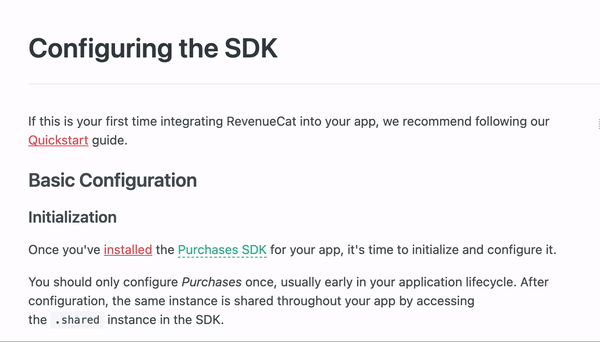

# Creating Strucutred Content 

When writing technical documentation there are cases where the information is best shown to the reader with a table, photo, etc. This guide will go over our best practices for creating additional structured content for a page.

## Tables vs Lists

We use tables and lists when we want to give complex data in an easier readable format.

When deciding if a table or list  is the right option let’s reference the table below:

| Item Type  |      Example      |  How to Present |
|:------------:|:-----------------:|:----------------:|
|Each item is a single unit |  List of steps to follow when debugging  | Numbered list, lettered list, bullet points |
| Each item is three or more pieces of related data |    A set of parameters in setting up a RevenueCat product |   Use a table  |

## Glossary
Throughout our documentation, we often are referencing products or tools that are unique to RevenueCat.In an effort to make sure our reader is always understanding our references. It’s best to add the glossary term to the reader than review while reading. You can review ReadMe glossary term guide here for how to add our documentation. 

## Photos
Some information is best displayed with a photo. We often use photos in our product installation guides to show different dashboards and other relevant information. 

When utilizing photos make sure only relevant information is captured. If pointing to specific items on the page make sure to mark up the image to reflect this. We use red identifiers when marking photos.

Here is an example of a photo marked up for documentation:

Don’t forget to create Alt text that described the photo. This allows access to screen reading technologies.

## Callouts
Some content is so important that we need to clearly separate it from the rest of the document. We use flavored callouts to display this. 

### Success
The success callout is best for letting the reader know a task is complete,  a small reminder before continuing, or a helpful tip. 

> 👍  Successs
> 
> You might let a reader know that they are good to move to the next document

### Info 
Info callout is best used for giving additional relevant information. These might be used to link out to external documents that a reader should continue looking into. 

>📘  Info
> 
> You could use this space to pointer a reader to some external documents

### Warning 
These are best used to alert our readers to process with caution or warn of a common mistake we see. 

> 🚧  Warning
> 
> You could let the reader know about a feature to be careful about
  
### Error
Error callouts are the least used in our documentation. These should only be used when ??

>❗  Error
> 
> Can be used to .....

## Next Steps 
At the end of our documents always include Next Steps at the bottom of a document when relevant. This can be the next document you want the reader to visit or a blog post that has similar useful information. 

Here is an example of a Next Steps included in our documentation:

